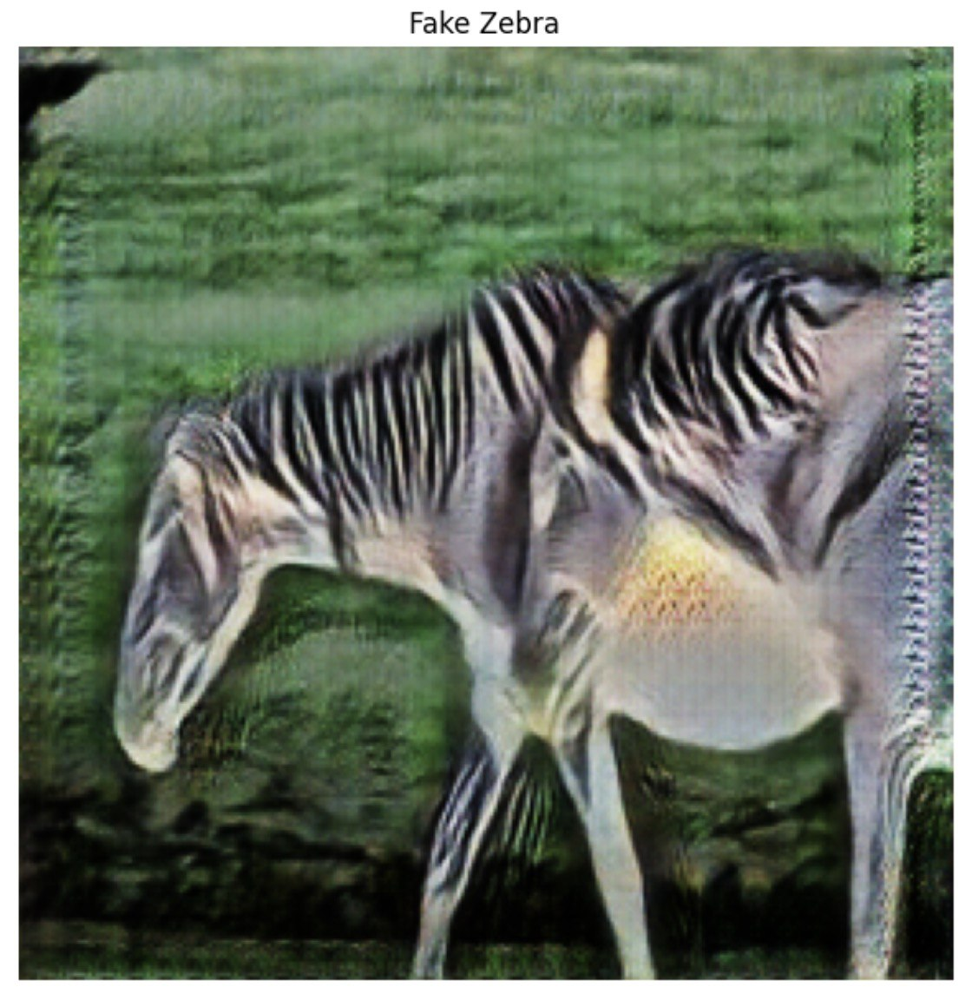
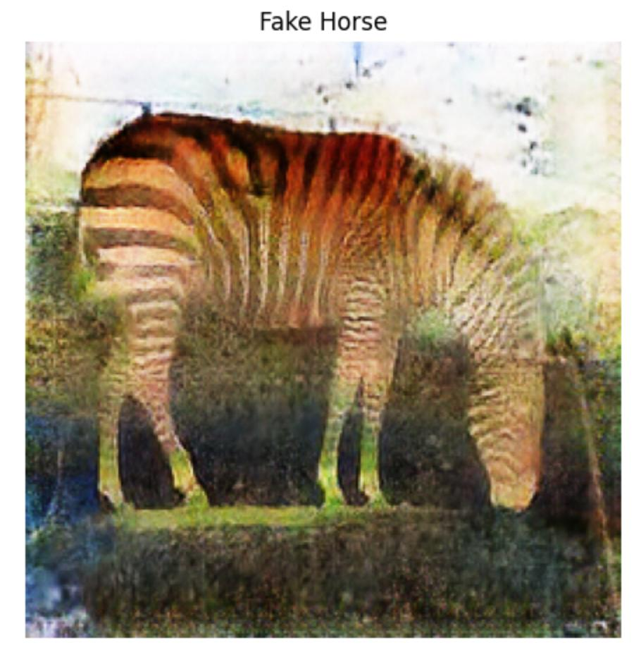

# Horse↔Zebra Image Translation Using CycleGAN

[](https://colab.research.google.com/github/md-naim-hassan-saykat/horse-to-zebra-cyclegan/blob/main/cyclegan-horse2zebra.ipynb)


This project implements **Cycle-Consistent Adversarial Networks (CycleGAN)** in PyTorch for unpaired image-to-image translation between horses and zebras.  
Both directions are trained (Horse→Zebra and Zebra→Horse). The models are evaluated with **qualitative visualizations** and **quantitative metrics (SSIM, PSNR)**.  

---

## Project Overview
- **Framework:** PyTorch  
- **Dataset:** [horse2zebra dataset on Kaggle](https://www.kaggle.com/datasets/suyashdamle/cyclegan) (original CycleGAN paper dataset, mirrored on Kaggle)
- **Generators:** U-Net-like encoder–decoder with residual blocks.  
- **Discriminators:** PatchGAN classifiers.  
- **Losses:**  
  - Adversarial (MSE)  
  - Cycle-consistency (L1)  
- **Optimization:** Adam (lr = 0.0002, betas = (0.5, 0.999))  
- **Training:** 100 epochs, batch size = 1  
- **Evaluation:** SSIM, PSNR  

---

## Repository Structure
cyclegan-horse2zebra/
│
├── notebooks/
│   └── cyclegan-horse2zebra.ipynb   # Main Jupyter Notebook
│
├── docs/
│   ├── main.tex                     # LaTeX report
│   ├── references.bib               # References for the report
│   ├── main.pdf                     # Compiled project report
│   └── figs/                        # Saved result figures
│       ├── real_horses.png
│       ├── fake_zebras.png
│       ├── real_zebras.png
│       └── fake_horses.png
│
├── requirements.txt
├── README.md
└── .gitignore

---

## Getting Started

### Clone the repo
```bash
git clone https://github.com/md-naim-hassan-saykat/cyclegan-horse2zebra.git
cd cyclegan-horse2zebra
## Install dependencies
pip install -r requirements.txt
Dependencies include:
	•	torch, torchvision
	•	scikit-image (for SSIM, PSNR)
	•	numpy, tqdm, PIL
	•	matplotlib
## Download the dataset
# Option 1: Kaggle (recommended)
kaggle datasets download -d suyashdamle/cyclegan -p ./data/
unzip ./data/cyclegan.zip -d ./data/

# Option 2: Direct download (mirror, if Kaggle not available)
wget http://efrosgans.eecs.berkeley.edu/cyclegan/datasets/horse2zebra.zip -O horse2zebra.zip
unzip horse2zebra.zip -d ./data/
## Train the model
Inside the notebook (notebooks/cyclegan-horse2zebra.ipynb), run the training loop:
for epoch in range(num_epochs):
    ...
## Generate results
Run the evaluation cells to produce:
	•	real_horses.png / fake_zebras.png
	•	real_zebras.png / fake_horses.png
### Example Results
### Horse → Zebra  
  

### Zebra → Horse  
  
Quantitative Evaluation
	•	SSIM: Structural Similarity Index (10 samples averaged)
	•	PSNR: Peak Signal-to-Noise Ratio (10 samples averaged)

These metrics provide a simple numerical check but are limited for unpaired translation tasks.
## Report

The full project report (LaTeX + PDF) is available in docs/:
## Read the Report (PDF)
## Future Work
	•	Add perceptual metrics: FID, LPIPS
	•	Incorporate semantic/attention-based models to improve structural consistency
	•	Extend to other unpaired datasets
## References
	•	[1] Isola et al., Image-to-Image Translation with Conditional Adversarial Networks (pix2pix), CVPR 2017.
	•	[2] Zhu et al., Unpaired Image-to-Image Translation using Cycle-Consistent Adversarial Networks (CycleGAN), ICCV 2017.
	•	[3] Wang et al., Image Quality Assessment: From Error Visibility to Structural Similarity (SSIM), IEEE TIP 2004.
	•	[4] Heusel et al., GANs Trained by a Two Time-Scale Update Rule Converge to a Local Nash Equilibrium (FID), NeurIPS 2017.
	•	[5] Zhang et al., The Unreasonable Effectiveness of Deep Features as a Perceptual Metric (LPIPS), CVPR 2018.
### Author

Md Naim Hassan Saykat
MSc in Artificial Intelligence, Paris-Saclay University
