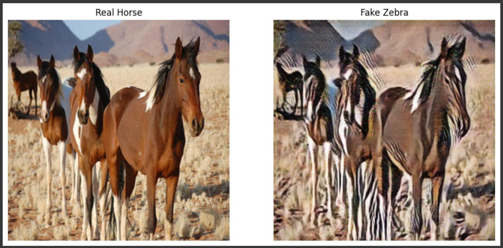

# Horse-to-Zebra Image Translation using CycleGAN

This project implements a CycleGAN to perform **unpaired image-to-image translation**, transforming horse images into realistic zebra images. Implemented in PyTorch and evaluated using SSIM and PSNR, the project explores generative modeling with adversarial training, residual networks, and cycle consistency.

## Team Members
- Md Naim Hassan Saykat — CycleGAN architecture, training loop, evaluation, report writing  
- Ahmed Nazar — Dataset preparation, preprocessing, augmentation, report writing  
- Nadja Zivkovic — Testing, validation, report writing  

All team members contributed to debugging and iterative model improvement.

---

## Project Files

[Jupyter Notebook](./cyclegan_horse2zebra.ipynb)
[Project Report](./cyclegan_report.pdf)

---

## Objective

Train a CycleGAN that learns to translate horse images into zebra images **without paired data**, and evaluate the quality using both **visual inspection** and **quantitative metrics** (SSIM & PSNR).

---

## Model Architecture

CycleGAN consists of:
- Two Generators (Horse→Zebra, Zebra→Horse)
- Two PatchGAN Discriminators
- Losses: Least Squares GAN + Cycle Consistency Loss (λ = 10)

**Generator:** ResNet-based with 9 residual blocks  
**Discriminator:** PatchGAN to capture fine-grained textures  
**Framework:** PyTorch

---

## Dataset and Preprocessing

- **Dataset:** Horse2Zebra from [CycleGAN official datasets](https://people.eecs.berkeley.edu/~taesung_park/CycleGAN/datasets/)
- **Total Images:** 1,187 horses and 1,474 zebras
- **Preprocessing:** Resize to 256×256, normalization to [-1, 1], data augmentation (random flip, crop)

---

## Training Details

- **Epochs:** 100  
- **Optimizer:** Adam (LR = 0.0002, β1 = 0.5, β2 = 0.999)  
- **Batch size:** 1  
- **GPU:** Google Colab  
- **Checkpointing:** Per-epoch visual outputs and model weights

---

## Evaluation Metrics

| Metric | Result |
|--------|--------|
| SSIM (avg) | 0.73 |
| PSNR (avg) | 22.4 dB |

Some results showed **convincing zebra transformation**, while others had **inconsistent textures** or color artifacts—especially in areas with shadows or dense textures.

---

## Example Output

---

## Technologies Used

- Python, PyTorch
- torchvision
- Jupyter Notebook
- Google Colab
- LaTeX (for report writing)

---

## References

1. [CycleGAN Paper (Zhu et al., 2017)](https://arxiv.org/abs/1703.10593)  
2. [Pix2Pix (Isola et al., 2017)](https://arxiv.org/abs/1611.07004)  
3. [GANs (Goodfellow et al., 2014)](https://arxiv.org/abs/1406.2661)  

---

## Disclaimer

This project is shared for academic demonstration purposes only.  
Reuse, reproduction, or distribution is not permitted without explicit permission.
